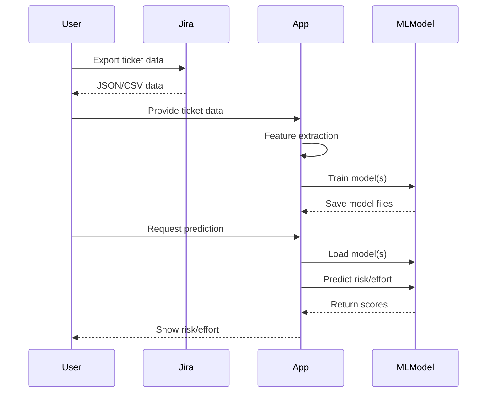

# NetConsoleWalsRiskJira

NetConsoleWalsRiskJira is a .NET console application that provides automated risk and effort analysis for Jira tickets using machine learning. It leverages the Weighted Alternating Least Squares (WALS) approach and ML.NET to train and apply regression models, helping teams prioritize and estimate work more effectively.

## Features

- **Jira Ticket Feature Extraction**: Parses and processes Jira ticket data to extract numerical features relevant for modeling.
- **Model Training**: Trains two separate regression models (for risk and effort) using ML.NET’s SDCA regression trainer.
- **Model Persistence**: Saves trained models to disk for later use.
- **Prediction**: Loads models and predicts risk and effort scores for new Jira tickets.
- **Test Coverage**: Includes unit tests to ensure model correctness and reliability.
- **Extensible Data Pipeline**: Designed for easy integration with Jira and other data sources.

---

## Architecture Overview

```mermaid
graph TD
    A[Jira Ticket Data] --> B[FeatureBuilder]
    B --> C[ModelTrainer]
    C -->|Train| D[ML.NET Regression Model]
    D -->|Save/Load| E[Model Files (.zip)]
    E -->|Predict| F[Risk & Effort Scores]
```

- **FeatureBuilder**: Extracts and flattens features from Jira tickets.
- **ModelTrainer**: Trains and saves ML.NET regression models for risk and effort.
- **Model Files**: Persisted models for later predictions.
- **Prediction**: Loads models and outputs risk/effort scores for new tickets.

---

## Data Flow



---

## Example Usage

1. **Train Model**
   - Input: Historical Jira ticket data with known risk and effort.
   - Output: Two model files (`model.risk.zip`, `model.effort.zip`).

2. **Predict**
   - Input: New Jira ticket features.
   - Output: Predicted risk and effort scores.

---

## Extensibility

- Easily adapt feature extraction for different Jira schemas.
- Swap out regression trainers or add new targets (e.g., cost, duration).
- Integrate with CI/CD for automated risk analysis.

---

## Project Structure

- FeatureBuilder.cs: Feature extraction logic.
- ModelTrainer.cs: Model training and prediction.
- Program.cs: Console entry point.
- SharedModels.cs: Data models.
- NetConsoleWalsRiskJira.Tests: Unit tests.

---

## Getting Started

1. Prepare your Jira ticket data.
2. Use the console app to train models.
3. Use the app to predict risk/effort for new tickets.

---

## License

MIT (or your chosen license)

---

Let me know if you want this as a Markdown file or need further customization!
